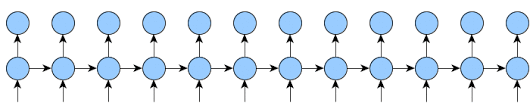

# TBPTT

Some implementations of truncated back-propagation through time (TBPTT) in Pytorch.

1. `demo_15500.py`
    - from https://discuss.pytorch.org/t/implementing-truncated-backpropagation-through-time/15500
    - problem: `RuntimeError: one of the variables needed for gradient computation has been modified by an inplace operation`
2. `demo_lightning.py`
    - from https://github.com/PyTorchLightning/pytorch-lightning/issues/293
    - problem: `only support k1 == k2 == tbptt_steps`

related resources:
1. https://github.com/hansungj/TruncatedBackpropagationThroughTime
2. https://www.cs.utoronto.ca/~ilya/pubs/ilya_sutskever_phd_thesis.pdf (see page 23)

